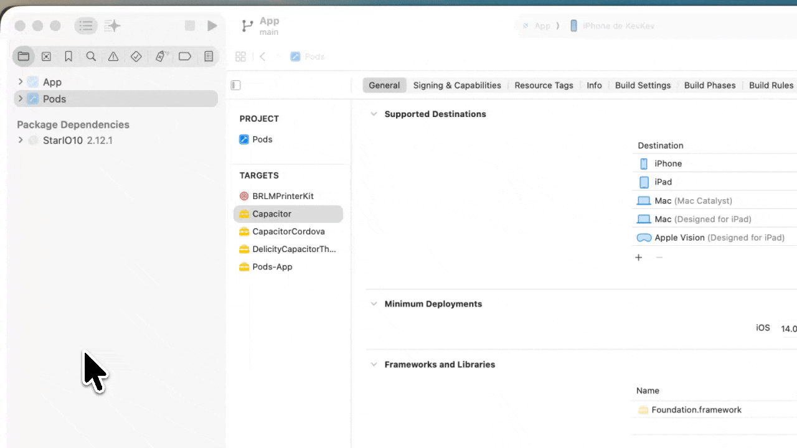

# Manufacturer SDK integration

This plugin supports 4 brands through their native SDKs: **Star, Epson, Brother, Zebra**.
All of them are **optional**: the plugin **compiles and installs without any manufacturer
SDK**, and each adapter activates **automatically** as soon as the matching binary is
present in your app. If it's absent, the adapter is skipped and the plugin falls back to
generic ESC/POS (TCP/Bluetooth/USB/BLE).

## TL;DR — which ones download themselves, and which don't?

| Brand | Android | iOS |
|---|---|---|
| **Star** | ✅ **auto** (Maven Central) | ✅ **auto** (Swift Package Manager) |
| **Brother** | ⛔ manual binary (`.aar`) | ✅ **auto** (CocoaPods) |
| **Epson** | ⛔ manual binary (`.jar` + `.so`) | ⛔ manual xcframework |
| **Zebra** | ⚠️ **private** Maven (token) or manual `.jar` | ⛔ manual xcframework |

> ### Why isn't everything auto-downloaded?
> Only SDKs published to a **standard package repository** (Maven Central for Android,
> CocoaPods/SPM for iOS) download automatically. Epson, Zebra, and Brother-Android are
> distributed **only through the manufacturer's portal**, and their **license forbids
> redistribution** (so they can't be put on Maven Central / CocoaPods, nor committed into
> the plugin's repo). This is a **legal** constraint imposed by the manufacturers, not a
> technical limitation of the plugin.
>
> ✅ **Compliant**: your app downloads the binary itself (accepting the license) and bundles
> it. The plugin ships all the code needed to drive it.

---

## Official download links

| Brand | Download page / SDK | Notes |
|---|---|---|
| **Star** | Android: [StarXpand-SDK-Android](https://github.com/star-micronics/StarXpand-SDK-Android) (Maven Central `com.starmicronics:stario10`) · iOS: [StarXpand-SDK-iOS](https://github.com/star-micronics/StarXpand-SDK-iOS) (SPM) | [StarXpand docs/manual](https://www.star-m.jp/products/s_print/sdk/starxpand/manual/en/index.html) |
| **Epson** | [Epson Developers – POS products](https://epson.com/developers-products) · [ePOS SDK (reference)](https://download4.epson.biz/sec_pubs/pos/reference_en/technology/epson_epos_sdk.html) | iOS Bluetooth MFi: see [MFi / ePOS SDK support](https://global.epson.com/products_and_drivers/tm/en/mfi.html) (account + license acceptance) |
| **Brother** | [Mobile SDK – download](https://support.brother.com/g/s/es/dev/en/mobilesdk/download/index.html) · US: [Brother Developer Program](https://developerprogram.brother-usa.com/sdk-download) | iOS: pod [BRLMPrinterKit](https://cocoapods.org/pods/BRLMPrinterKit) · [SDK manual](https://support.brother.com/g/s/es/htmldoc/mobilesdk/) |
| **Zebra** | [Link-OS Multiplatform SDK (dev portal)](https://developer.zebra.com/products/printers/link-os-multiplatform-sdk) · [Downloads & support](https://www.zebra.com/us/en/support-downloads/software/printer-software/link-os-multiplatform-sdk.html) | [Link-OS TechDocs](https://techdocs.zebra.com/link-os/) (a Zebra account is required) |

> The Epson / Brother / Zebra downloads require a free **developer account** and **acceptance
> of the manufacturer's license**. Star requires nothing (public Maven Central / SPM).

---

## Where to put the binaries (and never commit them)

The proprietary binaries are **git-ignored** (see `.gitignore`). To **test locally**, you can
drop them in:

```
android/libs/            # .aar / .jar / .so   (Android)
ios/Frameworks/          # .xcframework         (iOS)
sdk-binaries/            # free-form test folder, git-ignored
```

In production, place them in **your own app project** (see the per-brand sections below).

---

## ⭐ Star (no manual binary)

> The SDK comes from a public package repository (Maven Central on Android, SPM on iOS), so
> there's no binary to download by hand. Android is fully automatic; on iOS you just add the
> SPM package once.

### Android ✅ automatic — nothing to do
The Star dependency ships with the plugin and Gradle pulls it from Maven Central for you.

### iOS (one manual step: add the SPM package)
The Star iOS SDK is distributed via **Swift Package Manager** (there is no official pod).
Follow the official StarXpand steps, in your Xcode app project:
1. Select your **project** in the navigator, then **File ▸ Add Package Dependencies…**
   (older Xcode labels it **Add Packages…**). This is the item near the top of the File menu —
   *not* the **File ▸ Packages ▸** submenu (Reset/Resolve only).
2. Paste `https://github.com/star-micronics/StarXpand-SDK-iOS` into the **search field at the
   top-right** of the window, and wait for it to resolve.
3. Select **`StarXpand-SDK-iOS`** and press **Add Package**, then add the **`StarIO10`**
   product to your app target.


4. Run `npx cap sync ios` (or `pod install`) and rebuild. **That's it — no Podfile edit.**

> ℹ️ You don't need to touch the `Podfile`: just adding the SPM package to your app is
> enough for the plugin to pick Star up — Star support turns on by itself.

> ✅ Verified on a Capacitor 7 app + iOS simulator: after adding the SPM package,
> `getActiveSdks()` reports `star: available=true` and Star discovery routes through the SDK.

---

## 🟦 Brother

### Android (manual binary)
1. Download **Brother Print SDK v4** (`BrotherPrintLibrary.aar`) from the
   [Brother Mobile SDK portal](https://support.brother.com/g/s/es/dev/en/mobilesdk/download/index.html)
   (or the [Brother Developer Program US](https://developerprogram.brother-usa.com/sdk-download)) — license acceptance required.
2. Drop it into your app: `android/app/libs/BrotherPrintLibrary.aar`
3. In your app's `build.gradle`:
   ```gradle
   repositories { flatDir { dirs 'libs' } }
   dependencies { implementation(name: 'BrotherPrintLibrary', ext: 'aar') }
   ```
4. Done — Brother support turns on by itself once the `.aar` is present.

### iOS (one manual step: add the pod)
Add the pod to your app's `Podfile` (it's published on CocoaPods, so no binary to download).
In a Capacitor app the Podfile lives at `ios/App/Podfile`; add the line **inside the
`target 'App'` block**, where the `# Add your Pods here` comment is:

```ruby
target 'App' do
  capacitor_pods
  # Add your Pods here
  pod 'BRLMPrinterKit', '~> 4.12'
end
```

Then run `pod install` from `ios/App/` (or `npx cap sync ios`) — Brother support turns on by itself.

---

## 🟧 Epson (manual binary on both platforms)

### Android
1. Download the **ePOS SDK for Android** from [Epson Developers](https://epson.com/developers-products)
   ([ePOS SDK ref.](https://download4.epson.biz/sec_pubs/pos/reference_en/technology/epson_epos_sdk.html)) — license acceptance required.
2. Drop `ePOS2.jar` into `android/app/libs/` (plus the `.so` files into `src/main/jniLibs/` if provided).
3. In your app's `build.gradle`:
   ```gradle
   dependencies { implementation files('libs/ePOS2.jar') }
   ```
   ProGuard/R8 (release):
   ```
   -keep class com.epson.** { *; }
   -dontwarn com.epson.**
   ```
4. Done — Epson support turns on by itself once `ePOS2.jar` is present.

### iOS
1. Download the **ePOS SDK for iOS** — [direct download (Epson Download Center)](https://download-center.epson.com/download/?module_id=e5fde6cb-2f38-4bb3-b920-e53ee5b3190f%3A2.37.0&device_id=TM-m10&os=IOS&region=FR&language=fr)
   (or browse from [Epson Developers](https://epson.com/developers-products); Bluetooth MFi: see [MFi / ePOS SDK support](https://global.epson.com/products_and_drivers/tm/en/mfi.html)).
2. The SDK archive contains three frameworks — take the **dynamic** one,
   **`libepos2.xcframework`** (optionally also `libeposeasyselect.xcframework`, the
   printer-selection helper). In Xcode, **drag and drop** it onto the **`App` ▸ Frameworks**
   group, and in the dialog **tick "Copy items if needed"** so the framework is copied into
   the project (not just referenced from your Downloads folder). Leave it on **Embed & Sign**.
   > ⚠️ Do **not** also add `libepos2-static.xcframework` — it's the *static* variant of
   > `libepos2` (an alternative, not a complement). Since the Capacitor Podfile uses
   > `use_frameworks!`, use the dynamic `libepos2.xcframework`; adding both causes duplicate
   > symbols.
3. That's all on the app side: once `libepos2.xcframework` is on the `App` target, Epson
   support turns on by itself.
   > ⚠️ If your SDK version exposes a **different module name**, adjust it in
   > `EpsonAdapter.swift` (the two lines `canImport(libepos2)` and `import libepos2`).
4. **Enable signing for the embedded framework(s)** — see
   [Enable framework signing (iOS)](#enable-framework-signing-ios).


---

## 🟨 Zebra (Link-OS — ZPL/CPCL, never ESC/POS)

### Android — option A: private Zebra Maven repo (token required)
In `android/build.gradle` (block already present, commented out):
```gradle
maven {
    url "https://artifactory-us.zebra.com/artifactory/dmo-mvn-rel/"
    credentials {
        username = project.findProperty('zebraCoreId') ?: ''
        password = project.findProperty('zebraToken') ?: ''
    }
}
// dependencies { implementation 'com.zebra:zsdk-api:2.14.5198' }
```
Set `zebraCoreId` / `zebraToken` in `~/.gradle/gradle.properties` (obtained with a Zebra Core ID account).

### Android — option B: manual binary
Download the [Link-OS Multiplatform SDK](https://developer.zebra.com/products/printers/link-os-multiplatform-sdk),
drop `ZSDK_ANDROID_API.jar` (plus `ZSDK_ANDROID_BTLE.jar`) into `android/app/libs/`,
then `implementation files('libs/ZSDK_ANDROID_API.jar')`.

### iOS (manual xcframework)
1. Download the **Link-OS Multiplatform SDK** (iOS) from the
   [Zebra portal](https://developer.zebra.com/products/printers/link-os-multiplatform-sdk)
   ([downloads & support](https://www.zebra.com/us/en/support-downloads/software/printer-software/link-os-multiplatform-sdk.html)).
2. In Xcode, **drag and drop** `ZSDK_API.xcframework` onto the **`App` ▸ Frameworks** group,
   and **tick "Copy items if needed"** in the dialog so it's copied into the project. Leave it
   on **Embed & Sign**. Zebra ships a single framework, so there's no static/dynamic choice.
3. Once it's on the `App` target, Zebra support turns on by itself. (If your SDK build uses a
   different module name than `ZSDK_API`, adjust it in `ZebraAdapter.swift`.)
4. **Enable signing for the embedded framework** — see
   [Enable framework signing (iOS)](#enable-framework-signing-ios).


On Android, Zebra support turns on by itself once the `.jar` is present.

---

## Enable framework signing (iOS)

After adding a manufacturer `.xcframework` to the `App` target, make sure the framework is
**signed** by your app. In Xcode, open the **`App`** target ▸ **General** ▸ **Frameworks,
Libraries, and Embedded Content**, and set the framework's dropdown to **Embed & Sign**
(not "Do Not Embed" / "Embed Without Signing"). Otherwise the build can fail code-signing or
the app may be rejected at install.


